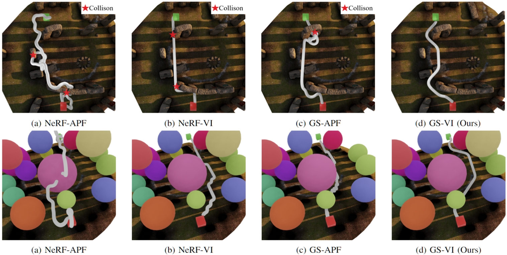
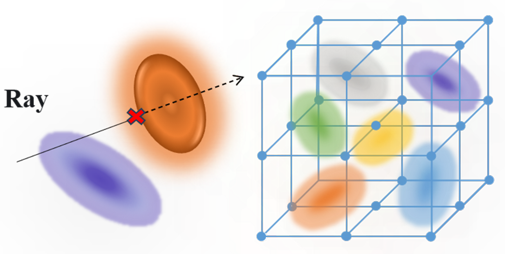

<p align="center">

  <h1 align="center">Risk-Aware Safe Feedback Motion Planning in Gaussian Splatting World</h1>

  <p align="center">
   <a><strong>Huanxiang Wang</strong></a>  
   ·
   <a><strong>Guoxiang Zhao*</strong></a>
  </p>
  <p align="center"><strong>ShangHai University</strong></p>
  <h2 align="center">ICUS 2024</h2>
  <h3 align="center"><a href="xxx">Paper</a> | <a href="https://drive.google.com/drive/folders/1rDmPzq7sxLYoQZSQ6KIQO4VG2LaKMdAP?usp=drive_link">Dataset</a> </h3>
 <div align="center"></div>
</p>
  <p align="center">
  <a href="">
    
  </a>
 <a href="">
    
  </a>
</p>
  
 


<br>


## Installation

We use [3D gaussian splatting](https://github.com/graphdeco-inria/gaussian-splatting) as the enviroment representation, please follow their instructions to install dependencies.

For the collection of image data, we use 3D modeling software [Blender](https://www.blender.org/).


## Downloading the stonehenge dataset and sphere dataset
Our datasets are hosted on a [Google Drive.](https://drive.google.com/drive/folders/1rDmPzq7sxLYoQZSQ6KIQO4VG2LaKMdAP?usp=drive_link) The scenes used in the paper are the Stonehenge and the Spherical obstacle scenario.


Here's our directory structure :

```
icus2024
├── data                                                                                                       
│   └── stonehenge
│       └── images
│       └── transforms.json                                                                                  
│   └── sphere
│       └── images
│       └── transforms.json                                                                                                                                                                                                                                                  
├──blender_scenes
│   └── sphere.blend
│   └── stonehenge.blend                                                                                         
│                                                                                                                               
├── outputs                                                                                                       
│   └── stonehenge
│       └── xxx.json
│   └── sphere
│       └── xxx.json                                                                                 
│               
├── train.py
```

## Training Gaussian Splatting
```bash
python train.py path/to/the/data
```

[//]: # (### Online)

[//]: # ()
[//]: # (You can SplaTAM your own environment with an iPhone or LiDAR-equipped Apple device by downloading and using the <a href="https://apps.apple.com/au/app/nerfcapture/id6446518379">NeRFCapture</a> app.)

[//]: # ()
[//]: # (Make sure that your iPhone and PC are connected to the same WiFi network, and then run the following command:)

[//]: # ()
[//]: # ( ```bash)

[//]: # (bash bash_scripts/online_demo.bash configs/iphone/online_demo.py)

[//]: # (```)


### Dataset Collection

If you would like to capture your own dataset in the Blender, please install [BlenderNeRF](https://github.com/maximeraafat/BlenderNeRF) following their instructions.


[//]: # (```bash)

[//]: # (bash bash_scripts/nerfcapture2dataset.bash configs/iphone/dataset.py)

[//]: # (```)


## Visualize
To visualize the trajectory in blender, please use the following command:
```bash
python viz_utils/viz_data_blend.py
```


[//]: # (## Acknowledgement)

[//]: # ()
[//]: # (We thank the authors of the following repositories for their open-source code:)

[//]: # ()
[//]: # (- 3D Gaussians)

[//]: # (  - [Dynamic 3D Gaussians]&#40;https://github.com/JonathonLuiten/Dynamic3DGaussians&#41;)

[//]: # (  - [3D Gaussian Splating]&#40;https://github.com/graphdeco-inria/gaussian-splatting&#41;)

[//]: # (- Dataloaders)

[//]: # (  - [GradSLAM & ConceptFusion]&#40;https://github.com/gradslam/gradslam/tree/conceptfusion&#41;)

[//]: # (- Baselines)

[//]: # (  - [Nice-SLAM]&#40;https://github.com/cvg/nice-slam&#41;)

[//]: # (  - [Point-SLAM]&#40;https://github.com/eriksandstroem/Point-SLAM&#41;)

[//]: # (## Citation)

[//]: # ()
[//]: # (If you find our paper and code useful, please cite us:)

[//]: # ()
[//]: # (```bib)

[//]: # (@inproceedings{keetha2024splatam,)

[//]: # (        title={SplaTAM: Splat, Track & Map 3D Gaussians for Dense RGB-D SLAM},)

[//]: # (        author={Keetha, Nikhil and Karhade, Jay and Jatavallabhula, Krishna Murthy and Yang, Gengshan and Scherer, Sebastian and Ramanan, Deva and Luiten, Jonathon},)

[//]: # (        booktitle={Proceedings of the IEEE/CVF Conference on Computer Vision and Pattern Recognition},)

[//]: # (        year={2024})

[//]: # (      })

[//]: # (```)

[//]: # (## Developers)

[//]: # (- [Nik-V9]&#40;https://github.com/Nik-V9&#41; &#40;[Nikhil Keetha]&#40;https://nik-v9.github.io/&#41;&#41;)

[//]: # (- [JayKarhade]&#40;https://github.com/JayKarhade&#41; &#40;[Jay Karhade]&#40;https://jaykarhade.github.io/&#41;&#41;)

[//]: # (- [JonathonLuiten]&#40;https://github.com/JonathonLuiten&#41; &#40;[Jonathan Luiten]&#40;https://www.vision.rwth-aachen.de/person/216/&#41;&#41;)

[//]: # (- [krrish94]&#40;https://github.com/krrish94&#41; &#40;[Krishna Murthy Jatavallabhula]&#40;https://krrish94.github.io/&#41;&#41;)

[//]: # (- [gengshan-y]&#40;https://github.com/gengshan-y&#41; &#40;[Gengshan Yang]&#40;https://gengshan-y.github.io/&#41;&#41;)
